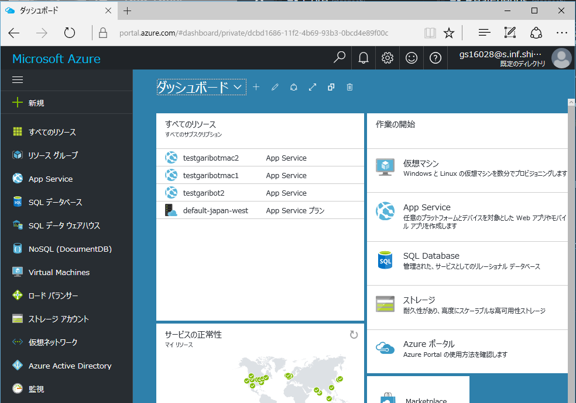
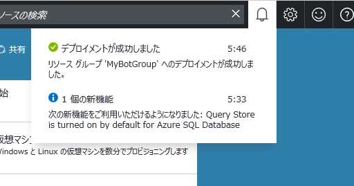
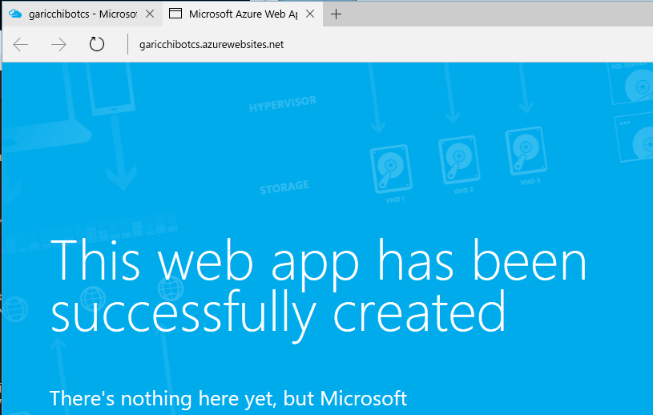

# Bot作成(C#編)チュートリアル
## 注意事項
このチュートリアルを行うには以下の環境がひつようになります。
- Windows10 PC
- Visual Studio Community 2015
- Microsoft Imagine (旧Dream Sparkのライセンス)
- Microsoft Azureの環境

まだ準備ができていない人はスタッフまで声をかけてください。

このチュートリアルには

- **学習価値のある一般技術知識**
- **ハッカソンでしか使えない技術知識**

の2つの情報が含まれています。

**学習価値のある一般技術知識**  は一般的に通用しているMicrosoftの技術知識です。ほかに応用が利くのでハッカソンを通して学習してもらえればと思います。

**ハッカソンでしか使えない技術知識**  今回、ハッカソンでアイデアを実現するために様々なライブラリや環境を用意しています。なのでこの知識は覚える必要はありません。ハッカソンで使ってあとは忘れてください。

## セットアップ
### プロジェクトを開く
**ハッカソンでしか使えない技術知識**

ダウンロードした201612hackathonyokohamaフォルダを開き、csharp/SampleBotフォルダの中にある```SampleBot.sln```をダブルクリックして開きます。


VisualStudioが立ち上がると、右上の```ソリューションエクスプローラー```という部分に3つのプロジェクトがあることがわかります。
3つのプロジェクトの説明は以下のとおりです。

- ```ApiSamples``` - Botの機能として使う各種APIのサンプルコード
- ```BotLibrary``` - Botの機能として使う各種APIを使うためのライブラリ
- ```SampleBot``` - Bot本体 (Asp.netのプロジェクト)


したがって、皆さんがBotを作るためにいじるプロジェクトは```SampleBot```プロジェクトとなります。

### Botのサーバーを作る
**学習価値のある一般技術知識**

Botはサーバー上で動くため、ホスティングするサーバーを立てなければなりません。
今回はMicrosoft Azureというクラウド上に、学生ライセンスを使って無料でホスティングを行います。

[http://portal.azure.com](http://portal.azure.com)にアクセスし、**MicrosoftImagineで学生認証を行ったMicrosoftアカウントでサインイン**します。

以下のような画面が表示されればOKです。


Webサーバーを作ります。Microsoft AzureではWebサーバーなどの資源は**リソース**として管理されます。
そしてMicrosoft AzureのWebサーバーは**Web App**というリソースになります。
Web Appを新規作成しましょう。

左上の```+新規```>```Web+モバイル```>```Web App```を選択します。


下図のような画面が出るので

- アプリ名 - お好きなIDを入力
- サブスクリプション - Microsoft Imagineを選択
- リソースグループ - 新規作成、```MyBotGroup```と入力
- App Serviceプラン/場所 - 後述

を入力します。

アプリ名は他人と被らないものを入力してください。右側に緑色のチェックマークが表示されればOKです。
```アプリ名.azurewebsites.net```がBotのURLとなります。

サブスクリプションの選択で```Microsoft Imagine```が表示されない方は学生認証の準備をしていない可能性があります。速やかに手を挙げてスタッフを呼んでください。


```App Serviceプラン/場所```をクリックすると下図のようになります。
```新規作成```を押し

- App Service プラン - お好きなIDを入力
- 場所 - Japan Eastを選択
- 価格レベル - F1 Freeを選択

を入力し、OKを押します。


ここまでできたら```作成```を押します。


右上のベルマークに```デプロイメントが成功しました```と表示されればOKです。



作成したWebサイトを見てみましょう。
左側の```すべてのリソース```から先ほど作成したIDをクリックします。


先ほど作成したWebAppの管理画面が表示されます。
URLが表示されているのでURLをクリックします。


Webサイトを表示することができました。
デフォルトで用意されているページが表示されているはずです。次はこのサーバーにBot用のプログラムを配置していきましょう。

