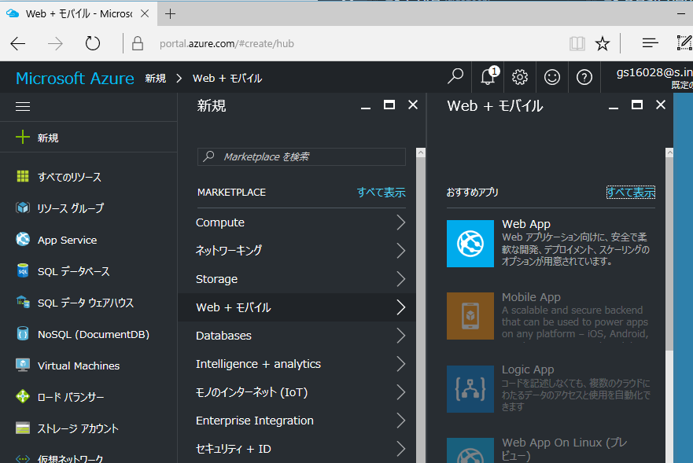
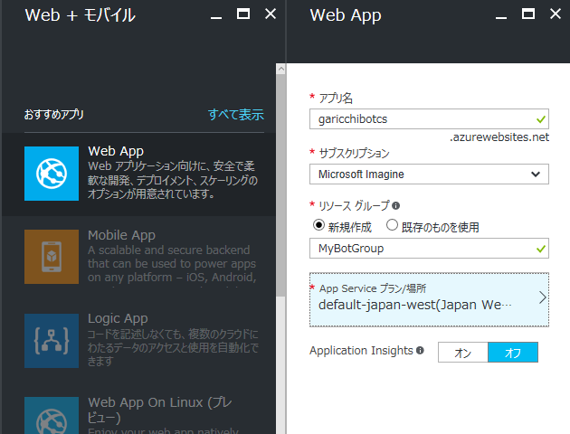
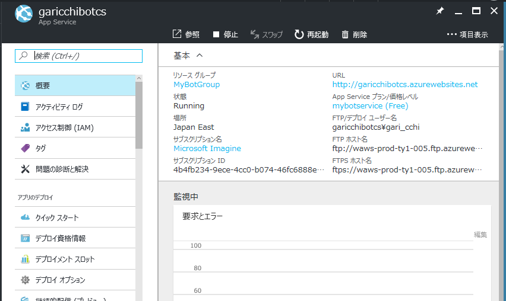
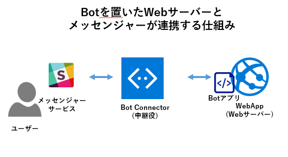
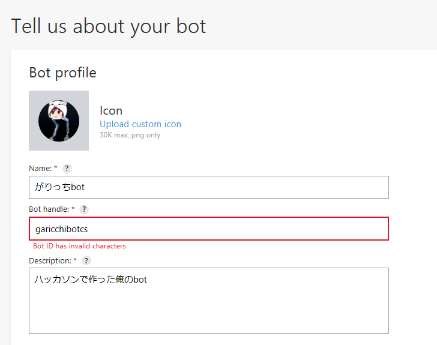
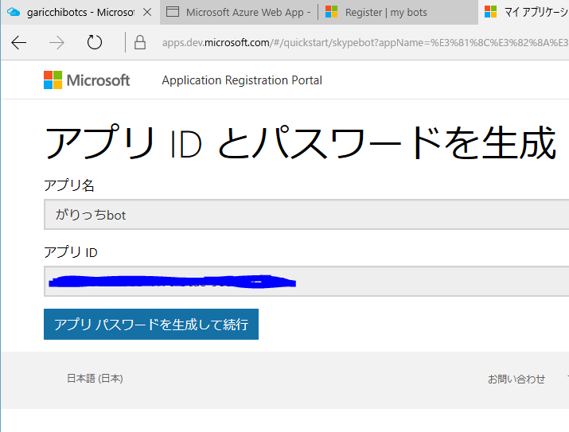

# Bot作成(C#編)チュートリアル
## 注意事項
このチュートリアルを行うには以下の環境がひつようになります。
- Windows10 PC
- Visual Studio Community 2015
- Microsoft Imagine (旧Dream Sparkのライセンス)
- Microsoft Azureの環境

まだ準備ができていない人はスタッフまで声をかけてください。

このチュートリアルには

- **```学習価値のある一般技術知識```**
- **```ハッカソンでしか使えない技術知識```**

の2つの情報が含まれています。

**```学習価値のある一般技術知識```**  は一般的に通用しているMicrosoftの技術知識です。ほかに応用が利くのでハッカソンを通して学習してもらえればと思います。

**```ハッカソンでしか使えない技術知識```**  今回、ハッカソンでアイデアを実現するために様々なライブラリや環境を用意しています。なのでこの知識は覚える必要はありません。ハッカソンで使ってあとは忘れてください。

## セットアップ
### プロジェクトを開く
**```ハッカソンでしか使えない技術知識```**

ダウンロードした201612hackathonyokohamaフォルダを開き、csharp/SampleBotフォルダの中にある```SampleBot.sln```をダブルクリックして開きます。


VisualStudioが立ち上がると、右上の```ソリューションエクスプローラー```という部分に3つのプロジェクトがあることがわかります。
3つのプロジェクトの説明は以下のとおりです。

- ```ApiSamples``` - Botの機能として使う各種APIのサンプルコード
- ```BotLibrary``` - Botの機能として使う各種APIを使うためのライブラリ
- ```SampleBot``` - Bot本体 (Asp.netのプロジェクト)


したがって、皆さんがBotを作るためにいじるプロジェクトは```SampleBot```プロジェクトとなります。

### Botのサーバーを作る
**```学習価値のある一般技術知識```**

Botはサーバー上で動くため、ホスティングするサーバーを立てなければなりません。
今回はMicrosoft Azureというクラウド上に、学生ライセンスを使って無料でホスティングを行います。

[http://portal.azure.com](http://portal.azure.com)にアクセスし、**MicrosoftImagineで学生認証を行ったMicrosoftアカウントでサインイン**します。

以下のような画面が表示されればOKです。


Webサーバーを作ります。Microsoft AzureではWebサーバーなどの資源は**リソース**として管理されます。
そしてMicrosoft AzureのWebサーバーは**Web App**というリソースになります。
Web Appを新規作成しましょう。

左上の```+新規```>```Web+モバイル```>```Web App```を選択します。



下図のような画面が出るので

- アプリ名 - お好きなIDを入力
- サブスクリプション - Microsoft Imagineを選択
- リソースグループ - 新規作成、```MyBotGroup```と入力
- App Serviceプラン/場所 - 後述

を入力します。

アプリ名は他人と被らないものを入力してください。右側に緑色のチェックマークが表示されればOKです。

アプリ名.azurewebsites.netがBotのURLとなります。

サブスクリプションの選択で```Microsoft Imagine```が表示されない方は学生認証の準備をしていない可能性があります。速やかに手を挙げてスタッフを呼んでください。



```App Serviceプラン 場所```をクリックすると下図のようになります。```新規作成```を押し

- App Service プラン - お好きなIDを入力
- 場所 - Japan Eastを選択
- 価格レベル - F1 Freeを選択

を入力し、OKを押します。


ここまでできたら```作成```を押します。


右上のベルマークに```デプロイメントが成功しました```と表示されればOKです。


作成したWebサイトを見てみましょう。
左側の```すべてのリソース```から先ほど作成したIDをクリックします。


先ほど作成したWebAppの管理画面が表示されます。
URLが表示されているのでURLをクリックします。



Webサイトを表示することができました。
デフォルトで用意されているページが表示されているはずです。


### BotをBot Connectorに新規登録する
**```学習価値のある一般技術知識```**

Microsoft BotFrameworkでは[Bot Connector](http://www.atmarkit.co.jp/ait/articles/1604/15/news032.html)というものを利用して、自分のBotを配置したWebサーバーとslackやSkypeなどのメッセンジャーサービスをつなげることができます。

なのでBotをメッセンジャーサービスにつなげるには、必ずBot Connectorに登録しなければいけません。



[BotFrameworkの公式サイト](https://dev.botframework.com)にアクセスします。

```Register a bot```をクリックします。


Microsoftのアカウントでのサインインを求められた場合、ご自身のMicrosoftアカウントでサインインしてください。

Botの新規登録ページが出てきたら下記の情報を入力してください。

- ```Icon```:Botのアイコンになります。好きなアイコンにしたければ30K以下のpngファイルを指定してください。特に気にならなければ何も指定しなくてOK
- ```Name```: Botの名前。好きな名前をどうぞ
- ```Bot handle```:BotのIDになります。他と被らない好きなIDを入れます。
- ```Description```:詳細説明。テキトーなことを書いてOK



- ```Messaging endpoint```:Botを配置したWebAppのURL。

```https://```{webappのID}.azurewebsites.net```/api/Messages```

を入力(↑**httpsなところに注意！**)

できたら```Create Microsoft App ID and password```ボタンを押します。


新しくタブが開くと、すでにアプリ名とアプリIDが入力されていると思います。

**アプリIDをどこかにメモしてください**

```アプリパスワードを作成して続行```ボタンを押します。



新しくパスワードが作成されましたという表示の元、Botのアプリパスワードが表示されます。

**このパスワードは1回しか表示されないのでかならずどこかにメモしてください**

(パスワードを忘れた場合再発行になります)

```OK``をおしてダイアログを閉じます


```終了してボットのフレームワークに戻る```を押します。

戻ると、アプリIDが入力されています

Adminの項目は何も入力しなくてもOKです。

一番下の```By clicking Register ～```の部分にチェックをいれ、```Register```ボタンを押してBotを新規登録します。


```Bot created```と表示されればOKです。```OK```ボタンをおします。


BotをBot Connectorに新規登録できました。


この時点で

- BotのMicrosoft App Id
- BotのMicrosoft App password

がどこかにメモできているでしょうか。
メモできていなければ、上の手順を読み直して、Botを再度作成してください。

### BotをBot Connectorに新規登録する
**```学習価値のある一般技術知識```**

Botを動かすためには、先ほど取得したBotのIDとpasswordを開発しているBotのプログラムに入力する必要があります。

VisualStudioを開き、SampleBotプロジェクトの中の、```Web.config```ファイルを開いてください。

Web.configファイルは下図のようなxmlファイルになっています。

その中に、```MicrosoftAppId```と```MicrosoftAppPasseword```の2つの項目があります(下図の赤い部分)

それぞれの```value```の部分に、先ほど取得したBotのMicrosoftAppIdとMicrosoftAppPasswordを入力してください。


### その他のWebAPIKeyを入れる
**```ハッカソンでしか使えない技術知識```**

ダウンロードしたSampleBotプロジェクトは、今回ハッカソンで使用する各種WebAPIのAPIKeyが入っていないため、ビルド(プログラムを実行ファイルにすること)ができません。

そこでまずはApiKeyを入力しましょう。

ソリューションエクスプローラーから```BotLibrary```プロジェクトを右クリックし、```追加```>```新しい項目```をクリックします。


新しい項目の追加ダイアログが表示されたら、真ん中のリストから、```クラス```という項目を選択し、```名前```の欄に**ApiKey.cs**と入力し、```追加```ボタンを押します。


ApiKey.csというファイルが新しく作成されるので、中身を以下のようにします。

```cs
public static class ApiKey
{
    public static string DOCOMO_APIKEY = "";
    public static string FACE_APIKEY = "";
    public static string EMOTION_APIKEY = "";
}
```


各種APIKeyはスタッフから指示があるまでお待ちください。

これで、メニューバーから```ビルド```>```ソリューションのビルド```を選択し、エラーが出なければOKです。


### Botをサーバーに配置する
**```学習価値のある一般技術知識```**

今回開発するBotはMicrosoftの[BotFramework](https://dev.botframework.com/)というものを使用して開発します。
BotFrameworkはC#とnode.jsの2種類の開発方法がありますが、C#での開発の場合、**ASP.net**という技術を用いてBotを開発します。
ASP.netはC#でWebアプリを作るテクノロジーです。

つまり、C#とBotFrameworkで開発したBotをWebサーバーに配置するということは、**ASP.netのWebアプリをWebサーバーに配置する**ということになります。

WebAppにアプリを配置するには、WebAppから```発行プロファイル```をダウンロードします。ダウンロードした発行プロファイルの情報を使用して、VisualStudioから、WebAppへアプリを配置することができます。


先ほどのWebAppを表示します。
```概要```を表示して、右側にある```項目表示```をクリックし、```発行プロファイルの取得```を押します。


発行プロファイルがダウンロードできます。


では実際に配置していきましょう。

VisualStudioでSampleBotプロジェクトを開き、ソリューションエクスプローラーからSampleBotプロジェクトを右クリックし、```公開```を押します。


発行ダイアログが表示されるので、```インポート```を押します。


発行プロファイルを指定するダイアログが表示されるので```参照```から先ほどダウンロードした```発行プロファイル```を指定します。


発行プロファイルを指定して```開く```を押します。


```OK```を押して発行プロファイルの指定を終わります。

正しい発行プロファイルを指定できた場合、下図のようになるので、```発行```を押します。


ブラウザで自分のWebAppのURLが表示され、Botのページへようこそという文字が表示されればWebAppへSampleBotの配置完了です。


### Botと対話してみる
**```学習価値のある一般技術知識```**

ここまでで、ついにBotをサーバーに配置し、対話できる状態になりました。
では実際に対話してみましょう。

再び[dev.botframework.com](https://dev.botframework.com/)にアクセスします。

自分が先ほど作成したBotを表示するために```My bots```をクリックします。


先ほど作成したBotの名前をクリックします。


Botのページが表示されました。

```Test```ボタンがありますがこれはおそらくクリックしてもエラーがでると思います。(すみません仕様です)


下にスクロールしていくと、チャットのテストをすることができます。
テキトーに入力して反応を見ましょう。

```こんにちは```と入力すると違った反応が見えると思います。


### Slackと連携する
**```学習価値のある一般技術知識```**

Botの準備はできたのでメッセンジャーアプリと連携してみましょう。
今回はいろんな都合により、slackを使いたいと思います。

slackのアカウントを持っていない人は、[https://slack.com/create](https://slack.com/create)にアクセスし、アカウントを新規作成してください。
基本的にはサイトに沿ってアカウントを作ることができるとは思いますがわからない場合はスタッフに声をかけてください。

slackのアカウントを作成することができたら、作成したBotのページにアクセスします。

下の方にスクロールすると、Slackのアイコンがあるので```Add```というところを押します。


slackの設定ページが表示されます。

最初の```Login to Slack～```をクリックして展開し、中にあるリンクをクリックします。


右上の```Create New App```ボタンをクリックします。


App Nameには英語で好きな名前を指定してください。Slack BotのIDになります。
Development Slack TeamはデフォルトのままでOKです。

```Create App```ボタンをクリックします。


左のリストから、```OAth&Permissions```を選択し、```Redirect URL(s)```のところに、以下のURLを入力します。

```
https://slack.botframework.com
```

入力できたら、```Save Changes```ボタンを押します。


左側のリストから、```Bot Users```をクリックし、```Add a Bot User```ボタンを押します。


```Add Bot User```ボタンをクリックします。


左側のリストから、```Basic Information```をクリックします。

表示された```Client ID```と```Client Secret(Showボタンを押したもの)```をどこかにメモしておいてください。


先ほどのBotとSlackの連携設定ページに戻り、```Submit your Credentials```を展開し、```Client Id```と```Client Secret```に先ほどコピーしたものを貼り付けます。

```Submit Slack Credentials```ボタンを押します。


```Autholize```をクリックします。


```Credentials have been validated```と表示されればOKです。

```I'm done configuring Slack```ボタンを押します。


以上でslackとBot Frameworkの連携が完了しました。

Slackを開くと、設定したBotがDirect Messageのところにいるので話すと、同じように会話することができます。

